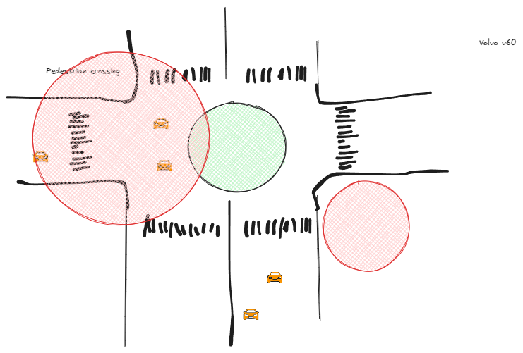

what is pedestrian crossing?

Pedestrian crossing is a place where pedestrians can cross the road safely. It is marked with white stripes on the road. Pedestrian crossings are usually found near schools, hospitals, and other places where there are many pedestrians.

roundabouts rules

Roundabouts are circular intersections where traffic moves in a counterclockwise direction. The rules for roundabouts are as follows:

1. Yield to traffic already in the roundabout.
2. Enter the roundabout when there is a gap in traffic.
3. Stay in your lane while in the roundabout.
4. Use your turn signal to indicate your exit.

right hand rule

The right-hand rule is a rule that states that vehicles must keep to the right side of the road. This rule is used in countries where vehicles drive on the right side of the road.

road signs

Road signs are used to provide information to drivers about the road ahead. There are different types of road signs, such as regulatory signs, warning signs, and guide signs. Regulatory signs are used to inform drivers of traffic laws and regulations. Warning signs are used to warn drivers of potential hazards on the road. Guide signs are used to provide information about destinations and directions.

road markings

Road markings are used to provide information to drivers about the road ahead. There are different types of road markings, such as lane markings, stop lines, and pedestrian crossings. Lane markings are used to indicate the number of lanes on the road and to guide drivers. Stop lines are used to indicate where vehicles must stop at intersections. Pedestrian crossings are used to indicate where pedestrians can cross the road safely.

road safety

Road safety is the practice of following traffic laws and regulations to prevent accidents and injuries on the road. There are many ways to improve road safety, such as obeying speed limits, wearing seat belts, and avoiding distractions while driving. By following road safety rules, drivers can help reduce the number of accidents on the road.

